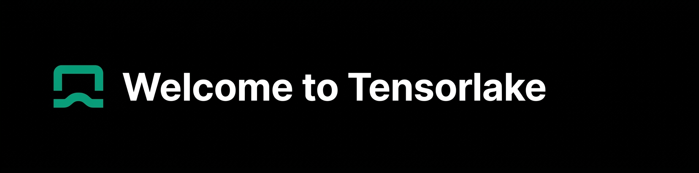

<div align="center">



### Agent-native compute infrastructure.
### Secure sandboxes that scale from one to thousands.

[Documentation](https://tensorlake.ai/docs) · [Book a Demo](https://calendly.com/diptanu-tensorlake/30min) · [Slack](https://tensorlakecloud.slack.com/)

</div>

---

Tensorlake provides dynamic, persistent sandboxes for AI agents. Run untrusted code securely, fan out parallel execution across clusters, and suspend/resume agents from cold storage — from the CLI or the Python SDK.

```bash
pip install tensorlake
tensorlake sandbox create --name my-sandbox
tensorlake sandbox exec my-sandbox "echo 'Hello from Tensorlake'"
```

```python
from tensorlake import Sandbox

sandbox = Sandbox.create()
result = sandbox.exec("echo 'Hello from Tensorlake'")

# Suspend to cold storage, resume later
snapshot = sandbox.suspend()
sandbox = Sandbox.resume(snapshot)
```

## Why Tensorlake

- **Distributed Fan-out** — Go from one sandbox to hundreds per second for deep research and parallel tool use
- **Stateful Suspend & Resume** — Checkpoint agents to cold storage, wake them up instantly when needed
- **Dynamic Resources** — Allocate CPU, memory, and GPU on the fly — no static templates
- **SSD-native I/O** — Built for workloads that read and write heavily, not just fast boot
- **BYOC / On-Prem** — Run on your infrastructure for cost control, security, and compliance
- **Install Anything** — Docker, Kubernetes, systemd — full Linux environments, not stripped-down containers

## Repositories

| Repository | Description |
|---|---|
| [tensorlake/sdk](https://github.com/tensorlake) | CLI and Python SDK |
| [tensorlake/cookbooks](https://github.com/tensorlakeai/cookbooks) | Example projects and integrations |
| [tensorlake/skills](https://github.com/tensorlakeai/tensorlake-skills) | Skills for coding agents to use Tensorlake |

## Get in Touch

- [Documentation](https://tensorlake.ai/docs)
- [Blogs](https://www.tensorlake.ai/blog)
- [Book a Demo](https://calendly.com/diptanu-tensorlake/30min)
- [Slack](https://tensorlakecloud.slack.com/)

<div align="center">

[](https://x.com/tensorlake)
[](https://www.linkedin.com/company/tensorlake)

</div>
